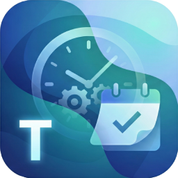

# FluentTaskScheduler

A modern, powerful, and intuitive Windows task scheduling application built with WinUI 3 and .NET 8.



## Overview

FluentTaskScheduler is a professional-grade wrapper for the Windows Task Scheduler API, designed with Microsoft's modern Fluent Design System. It provides a clean, user-friendly interface for managing complex automation tasks on Windows without the clutter of the legacy Task Scheduler UI.

## Key Features

- **Modern UI**: Clean and responsive interface using WinUI 3 and the Fluent Design System.
- **Task Management**: Create, edit, run, stop, and delete tasks with ease.
- **Advanced Triggers**:
  - **Daily**: Recur every X days.
  - **Weekly**: Select specific days of the week.
  - **Monthly**: Schedule on specific days or specific weeks (e.g., First Monday).
  - **Events**: At Logon, At Startup, or One Time.
- **Detailed Configuration**:
  - Set expiration dates and random delays.
  - Configure repetition intervals and durations.
  - Set idle, power (AC/Battery), and network conditions.
  - Advanced settings like "Run if missed" and "Restart on failure".
- **Search & Filter**: Quickly find tasks by name, path, or status (Running, Enabled, All).
- **Exporting**: Export task configurations for backup or migration.
- **PowerShell Friendly**: Built-in tips for scheduling PowerShell scripts effectively.

## Technology Stack

- **Framework**: [.NET 8](https://dotnet.microsoft.com/download/dotnet/8.0)
- **UI Library**: [WinUI 3](https://learn.microsoft.com/en-us/windows/apps/winui/winui3/) (Windows App SDK)
- **Backend API**: [TaskScheduler Managed Wrapper](https://github.com/dahall/TaskScheduler)
- **Language**: C#

## Getting Started

### Prerequisites

- [Visual Studio 2022](https://visualstudio.microsoft.com/vs/) with the "Windows application development" workload.
- [.NET 8 SDK](https://dotnet.microsoft.com/download/dotnet/8.0)
- Windows App SDK 1.5.240627000 or later.

### Building and Running

1. Clone the repository:
   ```bash
   git clone https://github.com/TRGamer-tech/FluentTaskScheduler.git
   ```
2. Open `FluentTaskScheduler.csproj` in Visual Studio.
3. Ensure the target platform is set to `x64`.
4. Press `F5` to build and run.

## License

This project is licensed under the MIT License - see the [LICENSE](LICENSE) file for details.
