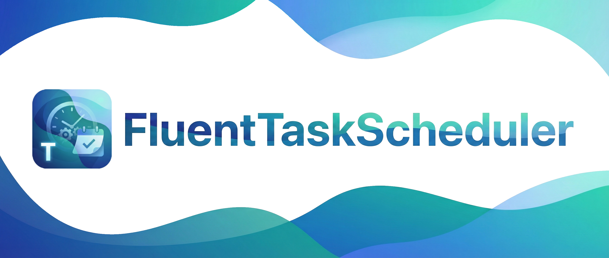

# FluentTaskScheduler

A modern, powerful, and intuitive Windows task scheduling application built with WinUI 3 and .NET 8.



## Overview

FluentTaskScheduler is a professional-grade wrapper for the Windows Task Scheduler API, designed with Microsoft's modern Fluent Design System. It simplifies the creation and management of automation tasks, offering a sleek alternative to the legacy Windows Task Scheduler.

### Donate on Buy me a coffee
If you like what this project is for, I would really appreciate a (optional!) donation:
<br><a href="https://buymeacoffee.com/t.r.g"></a>

## Screenshots

<p align="center">
  
  
</p>
<p align="center">
  
  
</p>
<p align="center">
  
  
</p>


## Installation instructions
### Manually
Go to the [Releases Page](https://github.com/TRGamer-tech/FluentTaskScheduler/releases) and download the newest version. Two formats are available per architecture (x64 / ARM64):
- **Setup MSI** — Traditional installer with per-user or machine-wide options.
- **Portable ZIP** — Extract anywhere and run. No installation required.

### Winget
```
winget install -e --id TRGamer-tech.FluentTaskScheduler
```

### Scoop
```
scoop bucket add extras
scoop install extras/fluenttaskscheduler
```

### Chocolatey
https://community.chocolatey.org/packages/fluenttaskscheduler
```
choco install fluenttaskscheduler
```

## Key Features

### 🕹️ Dashboard & Monitoring

- **Activity Stream**: A live feed of task activity. Click any entry to jump directly to the task details.
- **Task History**: Comprehensive history of all task executions, keeping you informed of every run.
- **Visual Analytics**: A dynamic task run history chart on the dashboard showing successes vs. failures over time.
- **Animated Status**: Clearly identify running tasks at a glance with animated status indicators.

### 🕒 Comprehensive Triggers

- **Time-Based**:
  - **One Time**: Run once at a specific date and time.
  - **Daily**: Recur every X days.
  - **Weekly**: Select specific days of the week (Mon-Sun).
  - **Monthly**: Schedule on specific dates (e.g., 1st, 15th) or relative patterns (e.g., First Monday of the month).
- **System Events**:
  - **At Logon**: Trigger when a user logs in.
  - **At Startup**: Trigger when the system boots.
  - **On Event**: Trigger based on specific Windows Event Log entries (Log, Source, Event ID).
  - **Session State Change**: Trigger on Lock, Unlock, Remote Connect, or Remote Disconnect.
- **Advanced Options**:
  - **Random Delay**: Add a random delay to execution times to prevent thundering herds.
  - **Expiration**: Set task expiration dates.
  - **Stop After**: Automatically stop tasks if they run longer than a specified duration.

### 🔄 Advanced Repetition

- **Task Repetition**: Configure tasks to repeat every few minutes or hours.
- **Recurring Tasks Support**: Set a repetition interval and duration per trigger for flexible automation.
- **Task Duration**: Set a duration for the repetition pattern (e.g., repeat every 15 minutes for 12 hours).

### 📜 Script Library

- **Centralized Management**: A dedicated space for pr-written PowerShell scripts, separating logic from task configuration.
- **Reusable Code**: Use scripts in multiple tasks.
- **Custom Templates**: Save and reuse your own task templates, going beyond just the pre-built scripts.

### 🛡️ Actions & Conditions

- **Actions**:
  - Run programs or scripts.
  - Specialized support for **PowerShell** scripts with execution policy bypass tips.
  - Custom working directories and arguments.
- **Conditions**:
  - **Idle**: Start only if the computer has been idle.
  - **Power**: Start only if on AC power; stop if switched to battery.
  - **Network**: Start only if a network connection is available.
  - **Wake to Run**: enhance reliability by waking the computer to execute the task.

### 🎨 Customization

- **Themes**: Choose between **Light Mode** and **Dark Mode** for a standard look, or go full stealth with **OLED Mode** (Pure Black) if you actually care about your display longevity.
- **Mica Effect**: Enable or disable the Mica effect for a more premium look.
- **Animated Icons**: UI elements that come to life, like the Settings icon that reacts to your touch.
- **Title Bar Integration**: Modern, customized title bar with proper drag regions that actually work (unlike some other apps we won't mention).
- **Multilingual**: Support for **English**, **German**, **Chinese**, and **Japanese** with a runtime language switcher.
- **Smooth Scrolling**: Optional smooth/inertia scrolling throughout the app, disabled by default for a snappier feel.
- **Window Size Memory**: The app remembers your last window size and restores it on next launch.

### 🧬 System Integration

- **ARM64 Support**: Native support for ARM64 devices.
- **System Tray**: Minimize the app to the tray to keep your taskbar clean while the scheduler hums in the background. Disabled by default.
- **Tray Badge**: See the number of currently running tasks at a glance directly on the tray icon.
- **Multi-Window Tray Management**: Open multiple windows and manage them independently from the tray right-click menu — restore or close individual windows, or open a new one, all from a single tray icon.
- **Tray Notification**: A toast notification appears the first time the app is minimized to tray, with a click action to restore the window instantly.
- **Single Instance**: Launching the app a second time brings the existing window to the front instead of opening a duplicate.
- **Run on Startup**: Option to launch automatically with Windows.
- **Notifications & Reminders**: Get native toast notifications and reminders for pending tasks, completions, or those annoying failures.
- **Onboarding Walkthrough**: Step-by-step onboarding for first launch to guide new users through key features.
- **Changelog Popup**: A "What's New" popup highlighting application updates the first time you run a new version.

### ⚙️ Robust Settings

- **Modern Navigation**: A reworked settings page utilizing `NavigationView` for that premium feeling you didn't know you needed.
- **Privileges**: Run tasks with highest privileges (Admin) or as System/Specific User.
- **Priority**: Configurable task priority (Realtime to Idle).
- **Concurrency**: Define behavior for multiple instances (Parallel, Queue, Ignore New, Stop Existing).
- **Fail-Safe**:
  - **Restart on Failure**: Automatically attempt to restart failed tasks up to a configured limit.
  - **Run if Missed**: Execute the task as soon as possible if a scheduled start was missed (e.g., computer was off).
- **Settings Backup**: Backup and restore your application settings to ensure your configuration is safe.

### 📊 Management & History

- **Task History**: View recent task execution history within the app (Today, Yesterday, This Week, All Time).
- **Detailed Analysis**: Click any history entry to open a deep-dive view with granular Event Log data (Event IDs, OpCodes, User context, etc.).
- **Categorization & Tags**: Organize tasks with custom tags and categories.
- **Smart Search**: Instantly find tasks by name, status, path, or those tags you just added.
- **Folder Management**: Organize your tasks logically by creating, renaming, and deleting custom folders. Features dedicated grip handles for reliable drag-and-drop reordering.
- **Smart Navigation**: The application remembers your last-used folder on restart.
- **Sortable Lists**: Sort tasks easily by clicking column headers directly in the task list (by name, status, next run, etc.).
- **Import/Export**: Easily backup or migrate task definitions. Supports importing to any selected folder.
- **Batch Operations**: Select and manage multiple tasks simultaneously.
- **CLI Support**: Full command-line interface for automation and headless management.

### ⌨️ Keyboard Shortcuts

| Shortcut   | Action                          |
| :--------- | :------------------------------ |
| `Ctrl + N` | New Task                        |
| `Ctrl + E` | Edit Selected Task              |
| `Ctrl + R` | Run Selected Task               |
| `Delete`   | Delete Selected Task            |
| `F5`       | Refresh Task List               |
| `Esc`      | Close Dialogs / Clear Selection |
| `?` / `F1` | Keyboard Shortcut Cheat Sheet   |

## 💻 CLI Reference

FluentTaskScheduler supports command-line arguments for integration with scripts and external tools.

```powershell
# List all tasks as JSON
FluentTaskScheduler.exe --list

# Run a specific task
FluentTaskScheduler.exe --run "MyTaskName"

# Enable or Disable a task
FluentTaskScheduler.exe --enable "MyTaskName"
FluentTaskScheduler.exe --disable "MyTaskName"

# Export task history to CSV
FluentTaskScheduler.exe --export-history "MyTaskName" --output "C:\logs\history.csv"
```

## Technology Stack

- **Framework**: [.NET 8](https://dotnet.microsoft.com/download/dotnet/8.0)
- **UI Architecture**: [WinUI 3](https://learn.microsoft.com/en-us/windows/apps/winui/winui3/) (Windows App SDK)
- **Core Logic**: [TaskScheduler Managed Wrapper](https://github.com/dahall/TaskScheduler)
- **CI/CD**: Fully automated GitHub Actions for x64 and ARM64 builds (thanks, TalyNone).
- **Auto-Update**: [VeloPack](https://velopack.io/) for seamless in-app updates via GitHub Releases.
- **Architectures**: Support for x64 and ARM64.
- **Language**: C#

## Building from Source / Publishing with VeloPack / Winget / Choco / Scoop

See [CONTRIBUTING](CONTRIBUTING.md) for details

## 🛠️ Troubleshooting

- **Crash Logs**: If the application encounters a critical error, a `crash_log.txt` file is generated in the application directory.
- **Admin Rights**: Some features (like "Run as SYSTEM") require the application to be run as Administrator.
- **Preferences storage**: The application stores its preferences as well as the log and custom script files in a JSON file in "%localappdata%\FluentTaskScheduler".
- **Portable distribution**: The portable release is a **ZIP archive** (folder), not a single `.exe`. WinUI 3 requires its native runtime DLLs to be present alongside the executable; single-file bundling is not supported and will crash on startup.

## Star History

<a href="https://www.star-history.com/#TRGamer-tech/FluentTaskScheduler&type=date&legend=top-left">
 <picture>
   <source media="(prefers-color-scheme: dark)" srcset="https://api.star-history.com/svg?repos=TRGamer-tech/FluentTaskScheduler&type=date&theme=dark&legend=top-left" />
   <source media="(prefers-color-scheme: light)" srcset="https://api.star-history.com/svg?repos=TRGamer-tech/FluentTaskScheduler&type=date&legend=top-left" />
   
 </picture>
</a>

## License

This project is licensed under the MIT License - see the [LICENSE](LICENSE) file for details.
